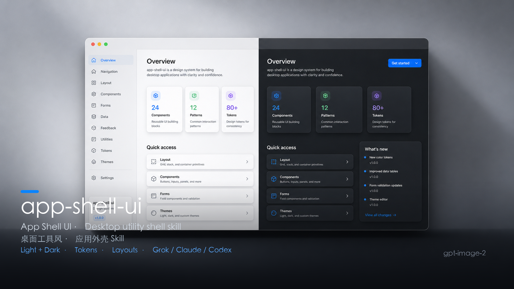
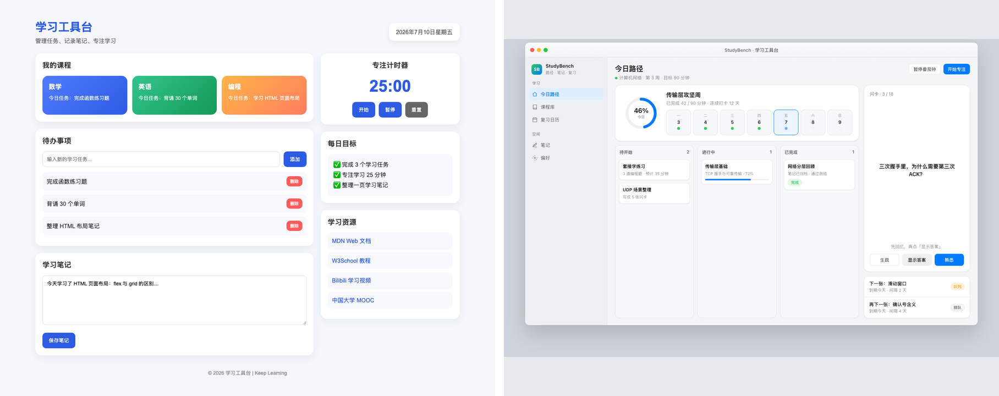
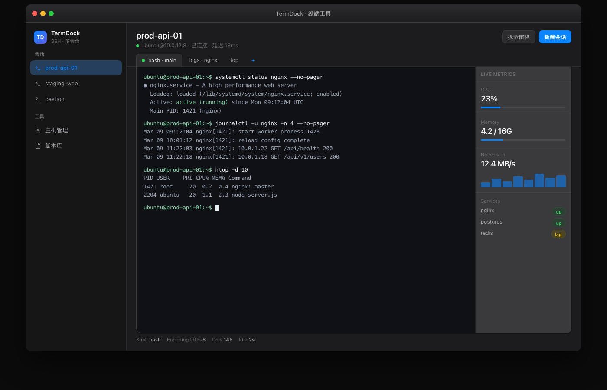
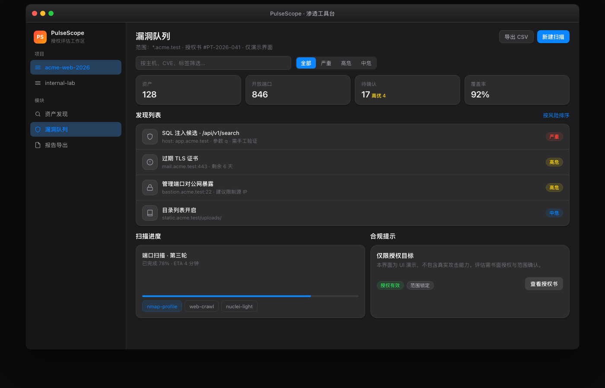
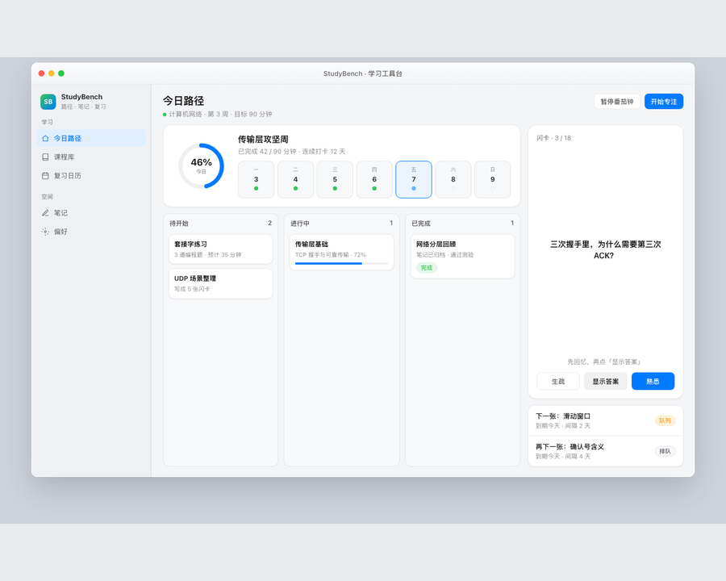
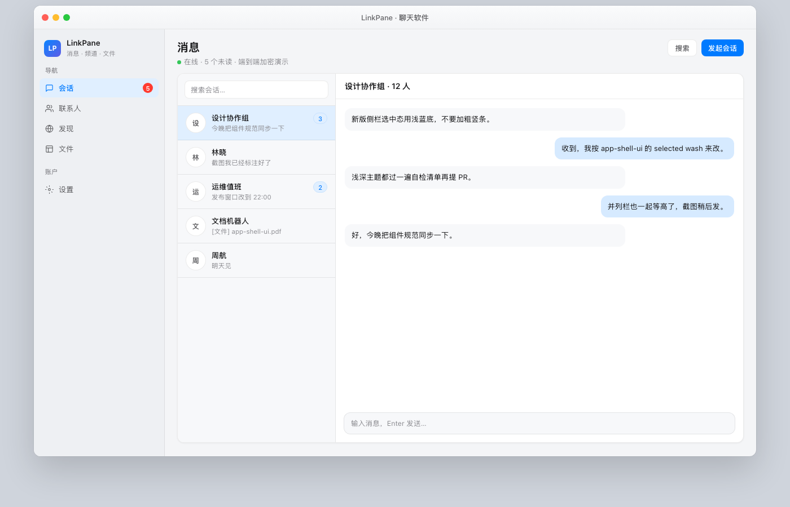

<div align="center">
  <p>
    
  </p>
  <p>
    <b>App Shell UI · 桌面工具风应用外壳 Skill</b><br>
    可复用的前端视觉语言：左导航 + 右内容 · 浅/深双主题 · Token 驱动 · 克制图标
  </p>
  <p>
    <a href="LICENSE"></a>
    <a href="#安装"></a>
    <a href="#技能索引"></a>
    <a href="#共享设计原则"></a>
    <a href="README_EN.md"></a>
  </p>
  <p>
    <a href="#安装">立即安装</a>
    · <a href="#快速开始">快速开始</a>
    · <a href="#技能索引">技能索引</a>
    · <a href="#共享设计原则">设计原则</a>
    · <a href="#目录结构">目录结构</a>
    · <a href="#更新">更新</a>
    · <a href="README_EN.md">English</a>
  </p>
</div>

---

* 本仓库维护 **App Shell UI** skill：让 AI agent 按统一规范生成「系统设置 / Clash Verge / 桌面客户端」一类界面，而不是落地页或密运营后台。
* 业务内容会变（水果市集、游戏论坛、AI 工作台…），**壳不换**：侧栏、画布、卡片、单主色、浅深主题、并列等高。
* 面向 **Codex / Claude Code / Grok** 等能加载 `SKILL.md` 的 agent；请**整目录安装**，不要只复制一个 `SKILL.md`。
* 仓库当前为 **Private**；源码许可为 **Apache License 2.0**。如需协作访问权限，请联系维护者。

## 案例展示

同一外壳，四种业务。可运行 Demo 在 [`demos/`](demos/)，截图在 [`assets/showcase/`](assets/showcase/)。

> **生成方式：无提示词，仅限定主题生成。**  
> 不额外规定版式细节，只给出主题（终端工具 / 渗透工具 / 学习工具台 / 聊天软件），由 `app-shell-ui` skill 约束壳层与风格后直接生成。

### Codex 写前端对比：学习工具台

同一主题「学习工具台」——**左：未使用 skill**；**右：使用 `app-shell-ui` skill**。

| 左 · [未使用 skill](demos/learning-before.html) | 右 · [使用 skill](demos/learning.html) |
| :---: | :---: |
| 彩色卡片堆叠 · 通用 Web 仪表盘 · 无统一壳层 | 桌面工具壳 · 侧栏导航 · Token / 克制配色 |

<p align="center">
  
</p>

### 四主题案例

<table>
  <tr>
    <td width="50%" valign="top">
      <p align="center"><b>终端工具 · TermDock</b></p>
      <p align="center"><a href="demos/terminal.html"></a></p>
      <p align="center"><sub>深色 · SSH 多会话 · 主机状态并列栏</sub></p>
    </td>
    <td width="50%" valign="top">
      <p align="center"><b>渗透工具 · PulseScope</b></p>
      <p align="center"><a href="demos/pentest.html"></a></p>
      <p align="center"><sub>深色 · 漏洞队列 · 授权范围提示（仅 UI 演示）</sub></p>
    </td>
  </tr>
  <tr>
    <td width="50%" valign="top">
      <p align="center"><b>学习工具台 · StudyBench</b></p>
      <p align="center"><a href="demos/learning.html"></a></p>
      <p align="center"><sub>浅色 · 路径卡片 · 复习队列 + 快速笔记等高</sub></p>
    </td>
    <td width="50%" valign="top">
      <p align="center"><b>聊天软件 · LinkPane</b></p>
      <p align="center"><a href="demos/chat.html"></a></p>
      <p align="center"><sub>浅色 · 会话列表 + 对话区三栏信息流</sub></p>
    </td>
  </tr>
</table>

本地预览 Demo：

```bash
cd demos
python3 -m http.server 8040
# 打开 http://127.0.0.1:8040/terminal.html
#      http://127.0.0.1:8040/pentest.html
#      http://127.0.0.1:8040/learning.html
#      http://127.0.0.1:8040/chat.html
```

## 快速开始

安装完成后，直接把任务描述交给 agent。下面提示词可复制使用：

| 想做什么 | 直接这样说 |
| --- | --- |
| 做一页桌面工具风 Demo | `用 app-shell-ui 做一个浅色 + 深色主题的设置页，左导航右列表开关。` |
| 控制台 / 卡片网格 | `用 app-shell-ui 控制台布局：统计卡 + 卡片网格 + 底部双栏等高。` |
| AI 工作台空态 | `用 app-shell-ui 工作台型：侧栏会话 + 居中新会话标题 + 大输入卡。` |
| 论坛 / 列表站 | `用 app-shell-ui 做游戏指南论坛：少 emoji，文字 + 线框图标，双主题。` |
| 只改视觉、不改业务 | `按 app-shell-ui 重画这个页面，保持信息架构，统一 Token 和浅深色。` |
| 并列栏对齐 | `双栏列表和提问卡底边对齐，按 app-shell-ui 的 equal-height 规则。` |
| 明确点名 skill | `使用 /app-shell-ui` 或 `使用 app-shell-ui skill` |

不确定时直接描述产品类型即可；agent 会按 skill 选型布局模板（设置 / 控制台 / 工作台 / 三栏）。

## 主要贡献者

* **yg2224**：`app-shell-ui` 维护者。
  * GitHub: [yg2224](https://github.com/yg2224)
  * Email: [2677406151@qq.com](mailto:2677406151@qq.com)

## 它能做什么

| 能力 | 说明 |
| --- | --- |
| 布局模板 | 设置型 · 控制台型 · 工作台型 · IM/三栏型 |
| 双主题 | `data-theme=light\|dark`，Token 成对交付，主题切换可持久化 |
| 组件配方 | 侧栏、页头、卡片、列表行、开关、Pill、Composer、虚线添加区 |
| 硬性约束 | 单主色、少 emoji、浅边框分层、并列栏等高、禁止 invert 伪深色 |
| 交付清单 | 浅色 + 深色各过一遍的自检表 |

**不是**：营销落地页、Material 厚阴影后台、彩虹图标仪表盘。

## 安装

`app-shell-ui` 是一个围绕 `SKILL.md` 组织的可复用技能包。`references/` 是规则细节，**安装时必须一并保留**。

### 克隆（通用）

```bash
# HTTPS（需有本私人仓库权限）
git clone https://github.com/yg2224/app-shell-ui.git

# 或 SSH
git clone git@github.com:yg2224/app-shell-ui.git
```

### Codex 安装方式

```bash
mkdir -p ~/.codex/skills
git clone https://github.com/yg2224/app-shell-ui.git ~/.codex/skills/app-shell-ui
```

或把仓库地址交给 Codex：

```text
请从这个私人仓库安装 skill（需要本机已登录有权限的 gh/git）：
https://github.com/yg2224/app-shell-ui.git

安装到 ~/.codex/skills/app-shell-ui，保留完整目录（SKILL.md + references/），不要只复制 SKILL.md。
```

### Claude Code 安装方式

推荐保留稳定 clone，再用 subagent 或 slash command 指向真实 `SKILL.md`，这样 `references/` 仍可被读取。

```bash
mkdir -p ~/ai-skills
cd ~/ai-skills
git clone https://github.com/yg2224/app-shell-ui.git
```

**Subagent wrapper：**

```bash
mkdir -p ~/.claude/agents
cat > ~/.claude/agents/app-shell-ui.md <<'EOF'
---
name: app-shell-ui
description: Use for macOS-style desktop utility UI shells, light/dark themes, sidebar layouts, and restrained frontend demos.
---

When invoked, first read `~/ai-skills/app-shell-ui/SKILL.md` and follow it as the governing workflow.
Read supporting files from `~/ai-skills/app-shell-ui/references/` only when needed.
Do not replace this skill with a generic flashy landing-page UI.
EOF
```

**Slash command wrapper：**

```bash
mkdir -p ~/.claude/commands
cat > ~/.claude/commands/app-shell-ui.md <<'EOF'
Read `~/ai-skills/app-shell-ui/SKILL.md` first and follow it strictly.
Read supporting files from `~/ai-skills/app-shell-ui/references/` when needed.

$ARGUMENTS
EOF
```

使用示例：

```text
/app-shell-ui 做一个游戏指南论坛首页，双主题，并列栏等高。
```

后续更新：

```bash
cd ~/ai-skills/app-shell-ui && git pull
```

### Grok 安装方式

Grok 从 `~/.grok/skills/<name>/` 加载 skill：

```bash
# 方式 A：直接克隆到 skills 目录
git clone https://github.com/yg2224/app-shell-ui.git ~/.grok/skills/app-shell-ui

# 方式 B：已有 clone，同步进去（排除 .git）
rsync -a --delete \
  --exclude .git \
  /path/to/app-shell-ui/ \
  ~/.grok/skills/app-shell-ui/
```

安装后新开 Grok 会话，触发：

```text
/app-shell-ui
```

或：

```text
用 app-shell-ui 做一页 macOS 风格的浅深色设置界面。
```

### 其他 agent

1. 将**完整目录**复制到该 agent 的 skills / prompt library。
2. 保留 `SKILL.md` 与 `references/*.md`。
3. 如目标平台有 frontmatter 要求，可微调但不删除 `name` / `description`。

## 目录结构

```text
app-shell-ui/
├── LICENSE                   # Apache License 2.0
├── README.md                 # 本说明（给人看）
├── README_EN.md              # English overview
├── SKILL.md                  # 主指令（给 agent 加载）
├── demos/                    # 四个案例 Demo（HTML）
│   ├── _shell.css
│   ├── terminal.html         # 终端工具
│   ├── pentest.html          # 渗透工具台
│   ├── learning-before.html  # 学习工具台 · 未使用 skill（对比）
│   ├── learning.html         # 学习工具台 · 使用 skill
│   └── chat.html             # 聊天软件
├── assets/
│   ├── readme-banner.png     # README 展示横幅
│   ├── readme-banner.svg
│   ├── readme-preview.jpg
│   └── showcase/             # 案例截图
│       ├── learning-compare.png  # 前后对比（等尺寸）
│       ├── learning-before.png
│       ├── learning-after.png
│       ├── terminal.png
│       ├── pentest.png
│       ├── learning.png
│       └── chat.png
└── references/
    ├── tokens.md
    ├── components.md
    └── layouts.md
```

关键规则：**整夹安装**。只丢一个 `SKILL.md` 会丢失 Token / 布局 / 组件细则。

## 技能索引

| 技能 | 状态 | 用途 | 触发词 | 入口 |
| --- | --- | --- | --- | --- |
| [`app-shell-ui`](SKILL.md) | Stable | 桌面工具风应用外壳：布局、双主题、组件、自检 | `app-shell-ui`、`/app-shell-ui`、桌面工具风、系统设置感、应用外壳、浅色/深色主题、sidebar shell | [SKILL.md](SKILL.md) |

### 参考文件

| 文件 | 用途 |
| --- | --- |
| [references/tokens.md](references/tokens.md) | 颜色 / 字阶 / 圆角 / 浅深 Token 与切换脚本 |
| [references/components.md](references/components.md) | 侧栏、卡片、列表、开关、Composer 等配方 |
| [references/layouts.md](references/layouts.md) | 设置/控制台/工作台/三栏 + **equal-height 双栏** |

## 共享设计原则

本 skill 遵守以下原则：

1. **壳稳定、业务可换**：同一外壳可套聊天、设置、库存、论坛，不换视觉系统。
2. **显式胜过隐式**：Token、圆角、选中态、主题 API 写清，不靠「看起来高级」。
3. **双主题一等公民**：默认同时交付 light + dark，禁止 `filter: invert()`。
4. **内容区克制**：线框图标 + 文字 + status pill；列表/卡片默认不刷 emoji。
5. **输出优先**：交付可运行的 HTML/React/CSS 变量实现，而不是空泛审美描述。
6. **并列要对齐**：并排卡片/面板底边等高（`stretch` + flex surface）。
7. **自检闭环**：浅色与深色各过交付清单再收工。

## 你可以直接这样问（更多例子）

```text
用 app-shell-ui 做一个 macOS 窗口壳的 AI 后端设置页，左导航 + 开关列表。
```

```text
按 app-shell-ui 规范给现有页面加 data-theme 深浅切换，Token 用 CSS 变量。
```

```text
首页底部「动态列表 | 快速提问」两列等高，输入框随高度拉伸。
```

```text
控制台型：Banner + 四格统计 + 三列卡片，少 emoji，单主色 #007AFF。
```

## 更新

```bash
cd /path/to/app-shell-ui
git pull

# 若安装到 Codex
rsync -a --delete --exclude .git ./ ~/.codex/skills/app-shell-ui/

# 若安装到 Claude Code 稳定 clone
# cd ~/ai-skills/app-shell-ui && git pull

# 若安装到 Grok
rsync -a --delete --exclude .git ./ ~/.grok/skills/app-shell-ui/
```

Codex / Claude Code / Grok 建议**新开会话**后再触发 skill，避免旧上下文。

## 状态标签

| 标签 | 含义 |
| --- | --- |
| `Draft` | 规则已写，案例未充分验证 |
| `Beta` | 已在示例页验证，边界仍可能调整 |
| `Stable` | 已在真实 Demo（设置/控制台/论坛等）验证，规则相对稳定 |

当前 `app-shell-ui` 标记为 **Stable**。

## 许可

本项目采用 [Apache License 2.0](LICENSE)。

```text
Copyright 2026 yg2224

Licensed under the Apache License, Version 2.0 (the "License");
you may not use this file except in compliance with the License.
You may obtain a copy of the License at

    http://www.apache.org/licenses/LICENSE-2.0

Unless required by applicable law or agreed to in writing, software
distributed under the License is distributed on an "AS IS" BASIS,
WITHOUT WARRANTIES OR CONDITIONS OF ANY KIND, either express or implied.
See the License for the specific language governing permissions and
limitations under the License.
```

你可以使用、修改、分发本 skill（含商用），但需保留版权与协议声明；修改后的文件建议注明变更。完整条款见 [LICENSE](LICENSE)。

仓库可见性目前为 **Private**，获得访问权限后方可 clone；许可条款在你获得源码后仍适用。

维护联系： [2677406151@qq.com](mailto:2677406151@qq.com)
