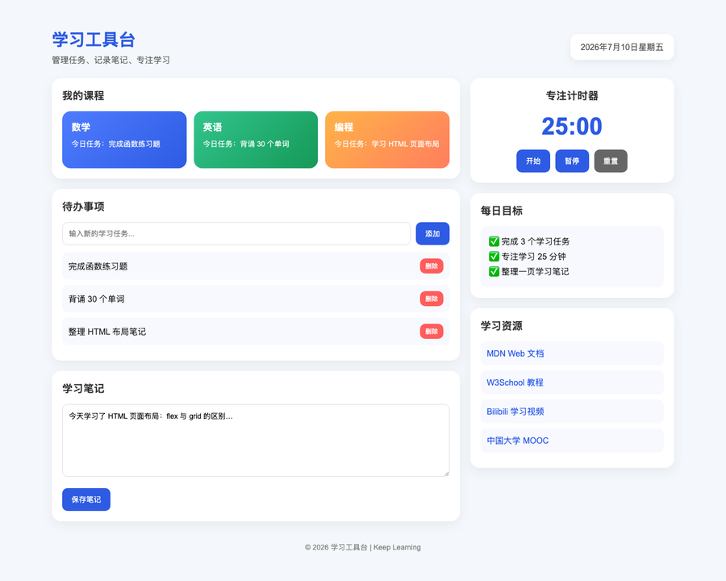

<div align="center">
  <p>
    
  </p>
</div>

# app-shell-ui

**App Shell UI** — a reusable desktop-utility frontend skill for AI agents (Codex / Claude Code / Grok).

Clean macOS-style shell: left nav + content, dual light/dark themes, CSS tokens, restrained stroke icons. Not a marketing landing page.

## Quick start prompts

| Goal | Say |
| --- | --- |
| Settings page | `Use app-shell-ui for a light+dark settings page with sidebar and toggles.` |
| Console grid | `Use app-shell-ui console layout: stats + card grid + equal-height two-col.` |
| Workbench empty | `Use app-shell-ui workbench: session sidebar + centered composer.` |
| Restyle only | `Restyle this screen with app-shell-ui tokens; keep IA.` |
| Reuse Top 50 UI | `Use app-shell-ui and adapt the bundled Top 50 command palette / kanban / AI chat reference.` |
| One-screen page | `Use app-shell-ui for a focused desktop page that fits one viewport; put secondary content in tabs or disclosure.` |

Slash / name: `/app-shell-ui` or `app-shell-ui`.

## Showcase

Four demos, one shell — screenshots under [`assets/showcase/`](assets/showcase/), sources under [`demos/`](demos/).

> **Generation: theme-only, no free-form prompt engineering.**  
> Only the subject domains were specified (terminal / pentest / learning / chat). Layout and look were constrained solely by the `app-shell-ui` skill.

### Before / after (learning workbench)

Same topic. Left: without skill. Right: with `app-shell-ui`. Both images are 900×720.

<table>
  <tr>
    <td width="50%" align="center" valign="top">
      <p><b><a href="demos/learning-before.html">Without skill</a></b></p>
      <a href="demos/learning-before.html"></a>
      <p><sub>Generic colorful dashboard</sub></p>
    </td>
    <td width="50%" align="center" valign="top">
      <p><b><a href="demos/learning.html">With skill</a></b></p>
      <a href="demos/learning.html"></a>
      <p><sub>Desktop utility shell</sub></p>
    </td>
  </tr>
</table>

### Four themes

| Case | Demo | Screenshot |
| --- | --- | --- |
| Terminal · TermDock | [terminal.html](demos/terminal.html) |  |
| Pentest console · PulseScope | [pentest.html](demos/pentest.html) |  |
| Learning bench · StudyBench | [learning.html](demos/learning.html) |  |
| Chat app · LinkPane | [chat.html](demos/chat.html) |  |

## Top 50 provenance and curation

The newly bundled Top 50 React components were exported from the maintainer's source workspace:

```text
/Users/yg2224/Desktop/project/UI-合集
```

They are the result of a single audit pipeline over AI-produced candidates, not 50 ad-hoc examples. The source audit contains **200 renderable candidates**:

| Source | Count | Implementation | Outcome |
| --- | ---: | --- | --- |
| GPT | 100 | Named studies rendered through shared templates | Scored as benchmark candidates |
| MiniMax | 100 | Dedicated React renderers | Source of the final Top 50 |

The source workspace also keeps `claude/` and `trea/` audit context, but those directories do not contain an independent renderable candidate catalog and are not counted as ranked submissions. Every candidate was scored with the FCBS rubric: Visual Quality (25%), Distinctiveness (10%), Product Utility (25%), Interaction & A11y (15%), and Engineering Quality (25%). The highest-ranked 50 were then hardened for responsive behavior, accessibility, and reusable exports before being copied into this skill.

The reusable output is kept here:

```text
assets/top50-react/components/items/   50 standalone React components
assets/top50-react/top50.json          machine-readable ranking
references/top50-components.md         progressive-disclosure index
scripts/sync_top50_assets.py           reproducible sync script
```

The complete audit data remains in `UI-合集/final/docs/`; this repository ships the reusable Top 50 result rather than every raw candidate and build artifact.

```bash
cd demos && python3 -m http.server 8040
# Open learning-program.html for the interactive study program demo.
```

## Install (keep full folder)

```bash
git clone https://github.com/yg2224/app-shell-ui.git

# Codex
rsync -a --exclude .git ./app-shell-ui/ ~/.codex/skills/app-shell-ui/

# Claude Code: clone to a stable path and point a subagent/slash command
# at SKILL.md (see Chinese README.md)

# Grok
rsync -a --exclude .git ./app-shell-ui/ ~/.grok/skills/app-shell-ui/
```

## Layout

```text
SKILL.md
references/
  tokens.md
  components.md
  layouts.md
  top50-components.md
assets/
  top50-react/
    components/items/   # 50 standalone React components
    data/top50.ts       # gallery registry
    globals.css         # demo tokens and animations
scripts/
  sync_top50_assets.py  # refresh the bundled gallery from the source project
demos/
  learning-program.html  # interactive study program demo
```

## Principles

1. Stable chrome, swappable business content
2. Explicit tokens over vibes
3. Light + dark as first-class
4. Text + stroke icons; no emoji-dense content
5. Equal-height peer columns
6. One-viewport desktop pages with bounded inner scrolling only for long collections
7. Deliver runnable UI + dual-theme checklist

## License

Licensed under the [Apache License 2.0](LICENSE).

```text
Copyright 2026 yg2224

Licensed under the Apache License, Version 2.0 (the "License");
you may not use this file except in compliance with the License.
You may obtain a copy of the License at

    http://www.apache.org/licenses/LICENSE-2.0

Unless required by applicable law or agreed to in writing, software
distributed under the License is distributed on an "AS IS" BASIS,
WITHOUT WARRANTIES OR CONDITIONS OF ANY KIND, either express or implied.
See the License for the specific language governing permissions and
limitations under the License.
```

You may use, modify, and distribute this skill (including commercially), provided you retain the copyright and license notices. See [LICENSE](LICENSE) for full terms.

The GitHub repository is currently **private**; clone access is limited to authorized users. The Apache-2.0 terms still apply once you have the source.

## Author

yg2224 · 2677406151@qq.com
