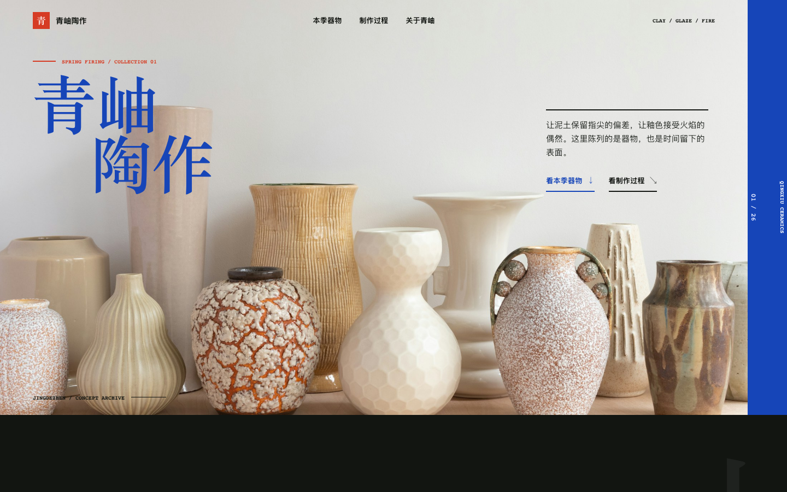
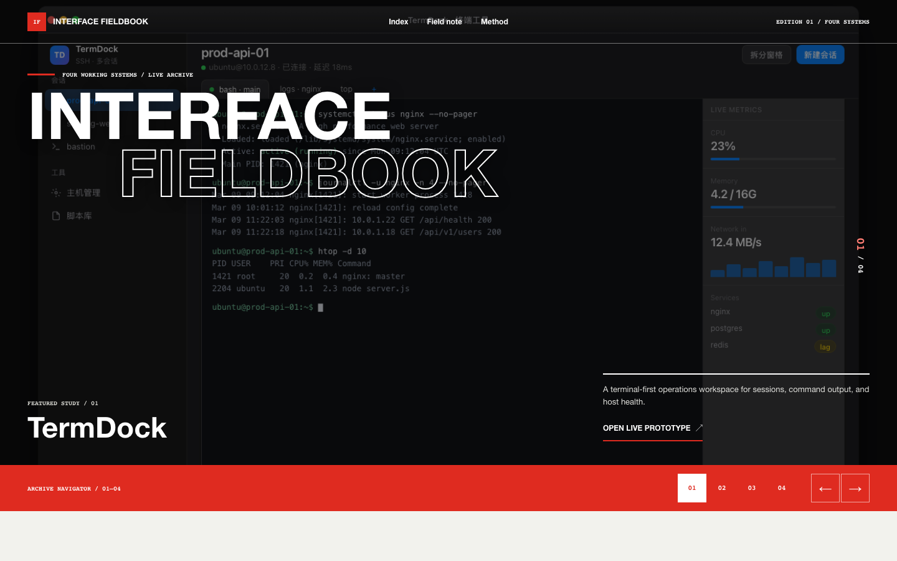
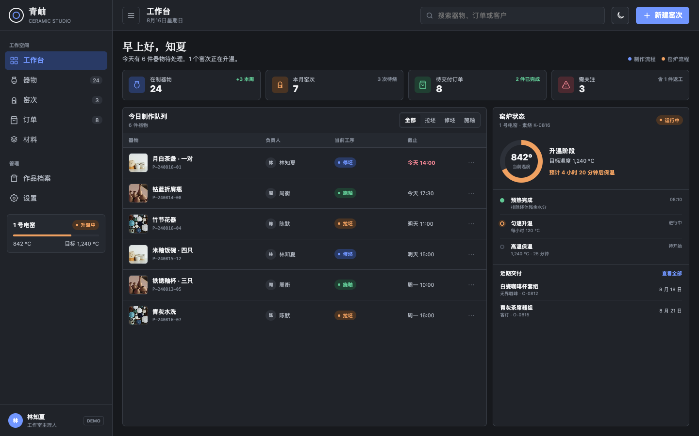

<div align="center">
  <p>
    
  </p>
  <p>
    <strong>One skill, two independent frontend design workflows.</strong><br>
    Website Mode serves public pages; App Mode serves signed-in products. Choose the surface before choosing pixels.
  </p>
  <p>
    <a href="LICENSE"></a>
    <a href="#install"></a>
    <a href="#two-modes"></a>
    <a href="#top-50-react-library"></a>
    <a href="README.md"></a>
  </p>
</div>

# app-shell-ui

`app-shell-ui` is a frontend design and implementation skill for agents such as Codex, Claude Code, and Grok. It first identifies the product surface, then follows one of two intentionally separate workflows:

- **App Mode** for signed-in settings, consoles, workbenches, chat, mail, and operational tools.
- **Website Mode** for marketing sites, landing pages, portfolios, editorial content, documentation, and catalogues.

The two modes share brand tokens only when appropriate. Their workflows, page structures, and examples remain independent, with separate density, theme, and scrolling decisions.

## Two modes

| | App Mode | Website Mode |
| --- | --- | --- |
| Typical use | Settings, consoles, AI workbenches, IM, desktop clients | Marketing, launches, portfolios, editorial, docs, catalogues |
| Visitor goal | Operate and evaluate state | Decide, read, experience, or browse |
| Default structure | Persistent navigation plus task canvas | A page-specific macrostructure selected from the journey |
| Height model | Primary desktop task fits one viewport; bounded inner scroll for long collections | Normal document scroll with a complete first viewport |
| Theme policy | Light and Dark by default | Determined by the brand; test paired tokens if both are supported |
| Evidence | Real state, lists, charts, and interaction | Real product UI, work, photography, or page-specific generated bitmaps |
| Avoid | Marketing heroes, rainbow icons, unbounded page scroll | Fake app chrome, generic hero plus three cards, fabricated proof |

Rule of thumb: **people doing work need App Mode; people learning, reading, or choosing need Website Mode.**

## Quick start

Install the complete folder, then describe the task:

```text
Use app-shell-ui for a ceramics studio dashboard: App Mode, console layout, Light and Dark, with today's production visible in one desktop viewport.
```

```text
Use app-shell-ui Website Mode for a ceramics studio website: work-first editorial composition, real object photography, and no generic SaaS card stack.
```

```text
Restyle this existing route with app-shell-ui. Preserve the information architecture and business logic; fix responsive overflow, focus, contrast, and interaction feedback.
```

Trigger it directly with `/app-shell-ui` or `use the app-shell-ui skill`.

## Dual-mode showcase

The four primary examples are presented in separate mode groups. Website Mode validates visitor journeys and document scrolling; App Mode validates signed-in task canvases and operational state. Every screenshot is a browser capture of the linked HTML demo.

### Website Mode: public pages

These examples do not use App Shell chrome. Their structure, pacing, media, and interaction are designed for public visitors.

<table>
  <tr>
    <td width="50%" valign="top">
      <p align="center"><strong>WEB 01 · Qingxiu Ceramics</strong><br><sub>Experience / Catalog</sub></p>
      <a href="demos/ceramics-final.html"></a>
      <p align="center"><sub>immersive object photography · asymmetric index · process disclosure and lightbox</sub></p>
    </td>
    <td width="50%" valign="top">
      <p align="center"><strong>WEB 02 · Interface Fieldbook</strong><br><sub>Experience / Work Index</sub></p>
      <a href="demos/interface-fieldbook.html"></a>
      <p align="center"><sub>full-screen study switcher · real demo captures · responsive work index</sub></p>
    </td>
  </tr>
</table>

| Website example | Primary job | Key implementation |
| --- | --- | --- |
| Qingxiu Ceramics | Understand the studio and browse its work and process | Local bitmaps, document scroll, mobile menu, lightbox |
| Interface Fieldbook | Browse and filter four interface studies | Real demo captures, project filters, mobile navigation, visible focus |

### App Mode: signed-in products

These examples do not use Website Mode's marketing or editorial structures. Stable chrome, state evaluation, and repeated action come first.

<table>
  <tr>
    <td width="50%" valign="top">
      <p align="center"><strong>APP 01 · Qingxiu Studio Console</strong><br><sub>Console</sub></p>
      <a href="demos/ceramics-studio-app.html"></a>
      <p align="center"><sub>one-viewport task canvas · Light / Dark · search, filters, and validation</sub></p>
    </td>
    <td width="50%" valign="top">
      <p align="center"><strong>APP 02 · TermDock</strong><br><sub>Workbench</sub></p>
      <a href="demos/terminal.html"></a>
      <p align="center"><sub>SSH sessions · terminal canvas · bounded live host status</sub></p>
    </td>
  </tr>
</table>

| App example | Primary job | Key implementation |
| --- | --- | --- |
| Qingxiu Studio Console | Manage production stages, kiln runs, and delivery | One-viewport canvas, Light / Dark, search, filters, form validation |
| TermDock | Judge SSH sessions, terminal output, and host state together | Stable sidebar, terminal canvas, bounded status rail |

### Local preview

```bash
cd app-shell-ui
python3 -m http.server 8040

open http://127.0.0.1:8040/demos/ceramics-final.html
open http://127.0.0.1:8040/demos/interface-fieldbook.html
open http://127.0.0.1:8040/demos/ceramics-studio-app.html
open http://127.0.0.1:8040/demos/terminal.html
```

Ceramics media lives under [`assets/ceramics/`](assets/ceramics/), while Interface Fieldbook uses real demo captures from [`assets/showcase/`](assets/showcase/). Neither demo requests third-party image hosts at runtime. When Imagegen is available and a Website Mode brief lacks suitable media, generate composition-specific bitmaps, save the selected outputs into the project, add meaningful `alt` text, and validate them inside the rendered page.

The README dual-mode cover was redrawn with `imagegen` using `gpt-image-2`, with the real Website and App demo captures as inputs. It summarizes the two independent design routes; the linked browser captures and HTML demos remain the source of evidence.

## Capabilities

| Capability | Includes |
| --- | --- |
| Surface routing | Separate public websites from signed-in products; split mixed projects by route |
| App layouts | Settings, Console, Workbench, IM / three-column |
| Website surfaces | Persuade, Read, Experience, Catalog |
| Website structures | Product reveal, evidence-led story, editorial narrative, work index, catalogue, reading guide, campaign poster |
| Visual systems | Semantic tokens, type roles, color/material, media treatment, one purposeful differentiator |
| Implementation | Responsive Grid, semantic HTML, keyboard/focus, form states, reduced motion, stable media geometry |
| App themes | `data-theme="light|dark"`, CSS variables, persistent toggle |
| React references | 50 reusable interactive components plus a machine-readable index |
| Verification | Desktop/mobile screenshots, overflow, contrast, truthful content, loading, and interaction checks |

## Workflow

### App Mode

1. Pick Settings, Console, Workbench, or IM / three-column.
2. Define the desktop viewport and the route's single primary task.
3. Lock paired Light and Dark tokens.
4. Compose with the sidebar, panels, rows, status pills, toggles, and composer recipes.
5. Verify both themes, desktop, and mobile after wiring interaction.

### Website Mode

1. State the page kind, audience, visitor job, and a specific tone.
2. Choose Persuade, Read, Experience, or Catalog.
3. Choose a content-specific macrostructure before components.
4. Use real, supplied, licensed, or page-specific generated media.
5. Implement complete states, semantics, responsive behavior, and accessibility.
6. Inspect real output at `320 / 375 / 414 / 768 / 1280+ px`.

[`SKILL.md`](SKILL.md) routes each request to the relevant references through progressive disclosure.

## Install

Install the **complete folder**. Copying only `SKILL.md` drops the App tokens/layout recipes, Website Mode guidance, and Top 50 source.

### Codex

```bash
mkdir -p ~/.codex/skills
git clone https://github.com/yg2224/app-shell-ui.git ~/.codex/skills/app-shell-ui
```

### Claude Code

```bash
mkdir -p ~/ai-skills
git clone https://github.com/yg2224/app-shell-ui.git ~/ai-skills/app-shell-ui
```

Point a subagent or slash command at the stable path:

```markdown
Read `~/ai-skills/app-shell-ui/SKILL.md` first and follow it as the governing workflow.
Read files under `references/` only when the selected mode requires them.

$ARGUMENTS
```

### Grok

```bash
git clone https://github.com/yg2224/app-shell-ui.git ~/.grok/skills/app-shell-ui
```

Start a new session after installation or updates, then trigger `/app-shell-ui`.

## Repository map

```text
app-shell-ui/
├── SKILL.md                       # agent entry point and mode routing
├── README.md / README_EN.md       # human documentation
├── references/
│   ├── tokens.md                  # App Light / Dark tokens
│   ├── layouts.md                 # App layouts and viewport budgets
│   ├── components.md              # App component recipes
│   ├── web-frontend.md            # complete Website Mode guide
│   └── top50-components.md        # React component index
├── assets/
│   ├── readme-banner.png          # Imagegen-generated README brand cover
│   ├── ceramics/                  # local ceramics demo bitmaps
│   ├── showcase/                  # README screenshots
│   └── top50-react/               # 50 React components and gallery resources
├── demos/
│   ├── ceramics-final.html        # Website Mode demo
│   ├── interface-fieldbook.html   # Website Mode work-index demo
│   ├── ceramics-studio-app.html   # App Mode demo
│   ├── terminal.html
│   ├── pentest.html
│   ├── learning.html
│   └── chat.html
└── scripts/
    └── sync_top50_assets.py       # Top 50 sync script
```

## Top 50 React library

[`assets/top50-react/`](assets/top50-react/) contains 50 reusable React interaction references across AI Interface, SaaS, Data Visualization, Information, Advanced UI, and Creative categories.

The provenance remains explicit: three models generated 100 raw candidates each. Only 200 GPT-5.6 and MiniMax M3 candidates remain available for audit; the 100 GLM 5.2 candidates were deleted or are missing and were excluded from the current scoring. The final 50 were selected from the auditable set using weighted Visual Quality, Distinctiveness, Product Utility, Interaction & A11y, and Engineering Quality criteria.

Read [`references/top50-components.md`](references/top50-components.md) first, copy only the required `components/items/*.tsx`, and preserve the relative locations of `components/shared.tsx` and `lib/cn.ts`. In App Mode, use them inside the selected shell layout. In Website Mode, reuse one only when it serves the page's task and has been visually adapted to the site's system.

```bash
python scripts/sync_top50_assets.py --source /path/to/top50
```

## Core constraints

1. Route App versus Website before choosing a familiar layout.
2. App Mode defaults to dual themes, one primary accent, a stable shell, and a one-viewport primary task.
3. Website Mode starts from the visitor journey, macrostructure, and media strategy, with normal document scrolling.
4. Never fabricate customers, metrics, testimonials, logos, product screenshots, or technical state.
5. Use real, supplied, licensed, or page-specific generated bitmap media with reserved dimensions and useful alt text.
6. Use one stroke-icon family; dense App lists default to zero emoji.
7. Use cards for repeated bounded items, controls, or genuine framed tools, not every page section.
8. Verify responsive behavior, keyboard/focus, contrast, states, reduced motion, and overflow before delivery.

## Maintenance and license

- Maintainer: [yg2224](https://github.com/yg2224)
- Issues / PRs: [yg2224/app-shell-ui](https://github.com/yg2224/app-shell-ui)
- Community: [linux.do](https://linux.do/)
- License: [Apache License 2.0](LICENSE)

Copyright 2026 yg2224. You may use, modify, and distribute this skill, including commercially, while retaining the copyright and license notices. See [`LICENSE`](LICENSE) for complete terms.
